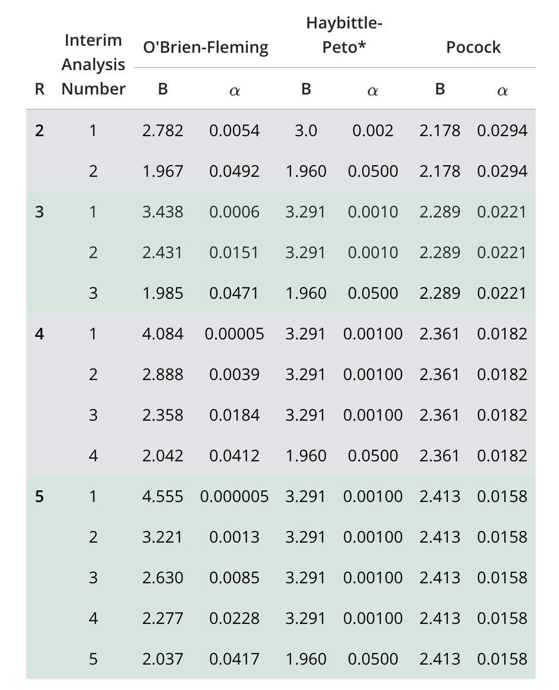

```{r setup, include=FALSE}
knitr::opts_chunk$set(echo = TRUE)
```

## Introduction

In a clinical trial, the traditional setup is: you estimate the parameters of interest (for example, the treatment effect size), choose your type I error rate $\alpha$ and power - $1 - \beta$ - from which you can estimate the sample size needed to show there is a statistical significance between groups (if one exists). The trial is then conducted according to this calculated sample size and the results are analysed to test for statistical significance at the nominated $\alpha$ level from the trial setup.

However, experimenters may want to look at the data before the conclusion of the trial. There are various different reasons for this, including considerations around safety and ethics. When experimenters look at the data before the conclusion of a trial, this is called an **interim analysis**. At an interim analysis, there are different decisions the experimenters can take. If they feel the treatment is no better than the control then they can decide to stop the trial here. This is called *stopping for futility* and it is used because it is unethical to continue to subject patients to a treatment that is no better than the control. If the trial stops early then the trial unit can save time, resources and money by not continuing with a trial that is not beneficial to continue. Another decision is to increase the sample size of the trial, this is done in situations where the treatment effect is showing to be working, but maybe the effect is not quite as large as they had thought when planning the trial. As a result, the trial is now underpowered and will not be statistically significant with the current sample size. Another decision is to keep the sample size the same as original - this can be due to two reasons. Talk etc. The last decision they can make is to stop the trial due to the treatment effect being greater than they had planned for and therefore the data is statically significant - this is called *stopping for efficacy*.

I will only focus on stopping for efficacy here. 

## An example

Imagine we are performing a clinical trial for a drug that is said to reduce systolic blood pressure in patients with hypertension. We will measure the systolic blood pressure of patients after a month (28 days) of taking this drug every day. After discussion with the clinicians, we have the following information: they believe for the control the endpoint will be Normally distributed with mean 160 and standard deviation 10. $X_c \sim N(160, 10^2)$. They also believe that the treatment will have a mean reduction of systolic blood pressure of 5 and the variation will be the same in both groups; therefore $X_t \sim N(155, 10^2)$. The plot below shows their beliefs:

```{r beliefs, echo=F }
x <- seq(120, 200, by=0.01)
control <- dnorm(x, 160, sd = 10)
plot(x,control, type="l", ylab="density", col="blue")
treatment <- dnorm(x, 155, sd =10)
lines(x, treatment, col="red")
legend("topright", legend=c("control", "treatment"), col=c("blue", "red"), lty=1)

```
We can use the information above to calculate the sample size required to find a statistically significance difference between these two groups. We wish to run our trial at $\alpha$ = 0.05 and power $1-\beta$ = 0.9. We calculate that we require 84 patients in each group, therefore the total sample size is 168. 

# ```{r, echo=F }
# sigma1 <- 10
# sigma2 <- 10
# alpha <- 0.05
# delta <- 5
# PowerFunc <- function(beta){
#   n1 <- ((sigma1^2+sigma2^2)*(qnorm(1-alpha/2)+qnorm(1-beta))^2)/(delta^2)
# n1 <- ceiling(n1)
# }
# betavec <- seq(0, 0.8, by=0.01)
# power <- rep(NA, length = length(betavec))
# for (i in 1:length(betavec)){
#   power[i] <- PowerFunc(betavec[i])
# }
# plot(power, 1-betavec, ylim=c(0,1), type="l", xlab="Sample size (n1)", ylab="Power", col="blue")
# abline(h = 0.9, lty=2)
# ```


## Interim analysis

We will illustrate what happens to the type I error rate if we do not adjust for multiple looks at the data. We will only consider stopping for efficacy here, which we will do if the t-test is significant at 0.05. We have two groups: control and treatment. They will both come from the same underlying distribution: $N(10, 5^2)$ as seen below

```{r control, echo=F }
x <- seq(-10, 30, by=0.01)
y <- dnorm(x, 10, sd = 5)
plot(x, y, type="l")
```


We will generate 100 samples for each group and then perform a t.test on these data:

```{r, echo=F }
testvec <- rep(NA, 10000)
for (i in 1:10000){
  controldata <- rnorm(100, 10, sd =5)
treatmentdata <- rnorm(100, 10, sd =5)
test <- t.test(controldata, treatmentdata)
testvec[i] <- test$p.value<0.05
}
mean(testvec)
```


We see that the null hypothesis is rejected 5% of the time, which is what we mean by type I error. We can see how this changes when we include interim analyses and allow ourselves to reject the null hypothesis at different points.


```{r, echo=F }

IAFunc <- function(numberofanalyses){
  testvec <- rep(NA, 5000)
for (i in 1:5000){
  rejected <- F
  controldata <- rnorm(100, 10, sd =5)
  treatmentdata <- rnorm(100, 10, sd =5)
  for (j in 1:numberofanalyses){
      cdata <- controldata[1:(j*(100/numberofanalyses))]
      tdata <- treatmentdata[1:(j*(100/numberofanalyses))]
      test <- t.test(cdata, tdata)
      if (test$p.value<0.05){
        rejected <- T
        break
    }
  }
testvec[i] <- rejected
}
  return(mean(testvec))
}


analyses <- 1:10
iavec <- rep(NA, 10)
for (i in 1:10){
  iavec[i] <- IAFunc(analyses[i])
}

plot(iavec, ylim=c(0, 0.25), xlab="Number of analyses", ylab="Type I rate", xlim=c(0, 10))
abline(h = 0.05, lty=2)

```

We see that, in general, as we increase the number of interim analyses, the type I error increases too. This is because we are giving ourselves multiple opportunities to reject the null hypothesis. A way to correct for this is to use alpha-spending functions. There are different alpha-spending schemes, but they are all designed to maintain the type I error rate at a prespecifed value (usually $\alpha = 0.05$). The two most famous schemes are the Pocock scheme and the O'Brien-Fleming scheme, which can be seen in the table below:


{#id .class width=30% height=30%}


