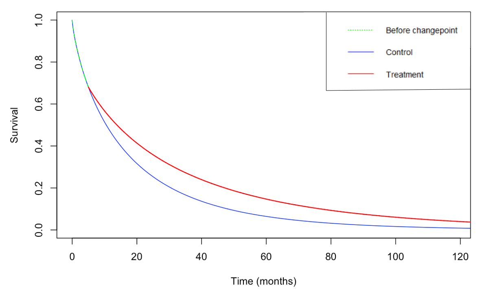

```{r setup, include=FALSE}
knitr::opts_chunk$set(echo = TRUE)
```

# Introduction

Delayed treatment effects are common in immunosuppressant treatments for cancer. There is a delay before the treatment starts to take effect, this behaviour can be seen in Figure 1. We can see that the two survival curves are the same before some changepoint - here the changepoint is $\approx$ 5 months. This poses a difficulty in designing and analysing trials in which DTE behaviour is present. The main drawback is that this setup violates the proportional hazards assumption we so commonly make in survival analysis. Therefore, we need to think of new techniques to design and analyse trials which exhibit this kind of behaviour. 



# Parameterisation

We would like to parameterise both of the curves using a known distribution - Exponential, Weibull etc. However, none of the known distributions captures the behaviour of the two survival curves tracking each other before the treatment kicks in. Therefore, we need to find a way of parameterising the above curves in a different way. We can do so by using adapted Weibull distributions as shown below:

```{=latex}

$$S_c(t) = \text{exp}\{-(\lambda_2t)^{\gamma_2}\}$$

\begin{equation*}
  S_t(t)=\begin{cases}
    \text{exp}\{-(\lambda_2t)^{\gamma_2}\}, & t \leq T\\
    \text{exp}\{-(\lambda_2T)^{\gamma_2}-\lambda_1^{\gamma_1}(t^{\gamma_1}-T^{\gamma_1})\}, & t > T,
  \end{cases}
\end{equation*}
```

where $S_c(t)$ is the survival curve for the control group, $S_t(t)$  is the survival curve for the treatment group and $T$ is the changepoint (where the treatment effect kicks in). 

We can estimate $\lambda_2$ and $\gamma_2$ for the control group - using historical data, pilot studies etc. Therefore, the three unknowns are $\lambda_1$, $\gamma_1$ and $T$.

## Hazards of the Weibull distrubtions

From the survival functions above we can determine the hazards of the two survival functions:

```{=latex}

$$\lambda_c(t) = \lambda_2\gamma_2(\lambda_2t)^{\gamma_2-1}$$
$$\lambda_t(t) = \mathds{1}\{t\leq T\}\lambda_2\gamma_2(\lambda_2t)^{\gamma_2-1}+ \mathds{1}\{t>T\}\lambda_1\gamma_1(\lambda_1t)^{\gamma_1-1}$$

```

## Hazard ratio

From the above hazards we can calculate the hazard ratio at $t$.

```{=latex}

\begin{equation*}
  \text{HR}(t)=\begin{cases}
    1, & t \leq T\\
    \frac{\lambda_1\gamma_1(\lambda_1t)^{\gamma_1-1}}{\lambda_2\gamma_2(\lambda_2t)^{\gamma_2-1}}, & t > T.
  \end{cases}
\end{equation*}

```

We see that before the changepoint, the hazard ratio is 1. This is to be expected as the two survival curves follow the same trend before the changepoint. After the changepoint, the hazard ratio is more complicated. This is a function that now depends on $\lambda_1$, $\lambda_2$, $\gamma_1$, $\gamma_2$ and $t$.


## How we can use this

To be able to use this parameterisation, we need to elicit beliefs (either explicitly or implicitly) about  $\lambda_1$, $\gamma_1$ and $T$. 

We should be able to elicit beliefs about $T$ fairly easily, we can just ask for the distribution of the changepoint (by using SHELF or similar software). 

This just leaves $\lambda_1$ and $\gamma_1$. It would be very difficult to elicit beliefs about these parameters explicitly as they do not have any tangible meaning in the context of the problem. We could use the formula for the Hazard Ratio above to implicitly elicit beliefs about these parameters. Before we do so, we should look at how changing $\lambda_1$ and $\gamma_1$ changes the survival curves. 

### Changing $\lambda_1$ and $\gamma_1$

We can look at the different cases here. We have:

* $\lambda_1=\lambda_2$, $\gamma_1=\gamma_2$
  + The treatment curve is exactly the same as the control curve
* $\lambda_1=\lambda_2$, $\gamma_1\neq\gamma_2$
  + When $\gamma_1$ > $\gamma_2$, the treatment curve is below the control curve. Clearly undesirable behaviour as we would assume the treatment is better.
  + When $\gamma_1$ < $\gamma_2$, the treatment curve is above the control curve. Looks plausible.
* $\lambda_1\neq\lambda_2$, $\gamma_1=\gamma_2$
  + When $\lambda_1$ < $\lambda_2$, the treatment curve is above the control curve. Looks plausible.
  + When $\lambda_1$ > $\lambda_2$, the treatment curve is below the control curve. Clearly undesirable behaviour as we would assume the treatment is better.
* $\lambda_1\neq\lambda_2$, $\gamma_1\neq\gamma_2$
  + When $\lambda_1$ > $\lambda_2$ and $\gamma_1$ > $\gamma_2$, the treatment curve is below the control curve. Clearly undesirable behaviour as we would assume the treatment is better.
  + When $\lambda_1$ > $\lambda_2$ and $\gamma_1$ < $\gamma_2$, the treatment curve can cross the control curve if we are not careful. Seems quite flexible behaviour but maybe too random. 
  + When $\lambda_1$ < $\lambda_2$ and $\gamma_1$ > $\gamma_2$, the treatment curve can cross the control curve if we are not careful. Seems quite flexible behaviour but maybe too random. 
  + When $\lambda_1$ < $\lambda_2$ and $\gamma_1$ < $\gamma_2$, the treatment curve is above the control curve. Looks plausible. 

So, from the above, we can see that when we vary $\lambda_1$ and $\gamma_1$, we vary the survival curves. We wish for our parameterisation and our elicitation process to be as simple as possible, so we propose that we use either scenario 2 or 3 here. We cannot use scenario 1 as this means that the treatment is no different from the control. We could use scenario 4, we have more flexibility here with the survival curves but the behaviour is quite random and hard to keep track of. It would be difficult to ask the right questions and to ensure the survival curves look plausible at the end of the elicitation process. 

Therefore, we have a choice of either scenario 2 or 3. We can look at scenario 2 first.

## Scenario 2: $\lambda_1 = \lambda_2, \gamma_1\neq\gamma_2$

We can see from above that we require $\gamma_1<\gamma_2$ for the treatment curve to be above the control. We can look at the hazard ratio in this case to see whether we could plausibly ask questions in this setup. 

The hazard ratio after the changepoint $T$ is:

$$\frac{\lambda_1\gamma_1(\lambda_1t)^{\gamma_1-1}}{\lambda_2\gamma_2(\lambda_2t)^{\gamma_2-1}}.$$

Using our assumptions, we can rearrange to obtain:

$$\text{HR}(t) = \frac{\gamma_1}{\gamma_2}\lambda_2^{\gamma_1-\gamma_2}t^{\gamma_1-\gamma_2},$$
which we see is a function of $t$. As $\gamma_1<\gamma_2$, this function will monotonically decrease as $t$ increases. This means that HR will be a function of $t$, which may not be something we desire. 

## Scenario 3: $\lambda_1 \neq \lambda_2, \gamma_1=\gamma_2$

We can see from above that we require $\lambda_1<\lambda_2$ for the treatment curve to be above the control. Again, we can look at the hazard ratio in this case to see whether we could plausibly ask questions in this setup.

As before, using our assumptions, we can rearrange the HR formula to obtain:

$$\text{HR}(t) = \bigg(\frac{\lambda_1}{\lambda_2}\bigg)^{\gamma_2},$$
which we see is no longer a function of $t$. This means that the HR will be constant over $t$, after the changepoint $T$. This is potentially beneficial if we believe that the HR will be constant after the changepoint. In this setup, we only have one question in our elicitation process: "What is the HR after the changepoint?". Once we have the answer to that question, we can rearrange the above to obtain the only unknown quantity - $\lambda_1$. In conclusion, we have set $\gamma_1 = \gamma_2$ and elicited $\lambda_1$ implicitly using the HR formula.  

# Elicitation

If we choose to proceed with Scenario 3, as described above, we have two stages of the elicitation process. The first step is to elicit a distribution about $T$, the time when the treatment effect kicks in. The second stage is to elicit  a distribution about the hazard ratio after the changepoint - we can then use this elicitation to make inferences about the unknown quantity $\lambda_1$. 

## Eliciting $T$

This elicitation process is fairly intuitive, the question posed is "what is the distribution of $T$?" - the time when the treatment starts to take affect. This could be done within the SHELF framework, the only constraints on $T$ is that it has to be a positive real number. 

## Eliciting HR

The method of eliciting HR is similar to above, $T$ and HR are independent so the answer to one should not influence an answer to another. The constraints on HR is that it should be a real number with lower bound 0 and upper bound 1, HR $\in$ [0,1]. 

## Elicitation example

As an example, we can imagine we have facilitated an elicitation of both the parameters, T and HR. We have elicited known distributions for both (this is not strictly required - but we do need to be able to draw samples from the elicited distributions). 

For $T$, we have elicited a Normal distribution with mean 5 and variance 1. This can be shown in the following plot:

```{r, echo=F}

x <- seq(0, 10, by=0.1)
y <- dnorm(x, 5, sd = 1)
plot(x, y, type="l", xlab="T", ylab="density")
```

We can see that the most likely value for $T$ is 5, but values between (2, 8) are also plausible. 

We can do the same for the hazard ratio. We elicit a Beta distribution with parameters Be(6, 3) as shown below. We notice that this distribution is not symmetric, but we are able to easily draw samples from it.

```{r, echo=F}

x <- seq(0, 1, by=0.01)
y <- dbeta(x, 6, 3)
plot(x, y, type="l", xlab="HR", ylab="density")
```

# Assurance

To calculate assurance for this setup, we need to be able to draw samples from both the control and treatment groups and then perform the necessary statistical test(s) (log rank, RMST) on these data to determine whether the groups statistically differ. We can do this multiple times for a given sample size - $n_1, n_2$ to calculate the probability that the trial will be a success given these initial conditions. We can let $n_1, n_2$ vary to compute the assurance for different sample sizes and we can calculate the sample sizes needed for the required level of assurance that the trial requires. 

## Example of assurance

### Control data

We assume we have enough data about the control - through historical data, pilot studies etc - to be able to estimate $\lambda_2$ and $\gamma_2$ for the Weibull survival curve. In this setup, we will assume we have calculated $\lambda_1$ = 0.06 and $\gamma_2$ = 0.8. These parameters give the following survival curve for the control group:

```{r, echo=F}

x <- seq(0, 120, by=0.01)
y <- dbeta(x, 6, 3)
plot(x, y, type="l", xlab="HR", ylab="density")
```


Using our elicited distributions for $T$ and HR as above, we present an example of an assurance calculation with this setup. We first fix $n_1$ and $n_2$, this will be the sample size we are calculating assurance for. We let $n_1=n_2=100$. We can draw samples from our elicited distributions for $T$ and HR to obtain a realisation of a clinical trial as follows. 

Firstly, we draw a sample from $T$.

```{r, echo=F}

set.seed(123)
rnorm(1, 5, 1)
```
This gives us a value of $\approx 4.44$. This will be our $T$ value in this realisation.

Secondly, we can draw a sample from the distribution of HR. 

```{r, echo=F}

set.seed(123)
rbeta(1, 6, 3)
```

This gives us a value of $\approx 0.76$. This is our value for HR in this realisation. Now, we need to use this value to obtain $\lambda_1$. 

From **Scenario 3**, we know the following formula holds true:


